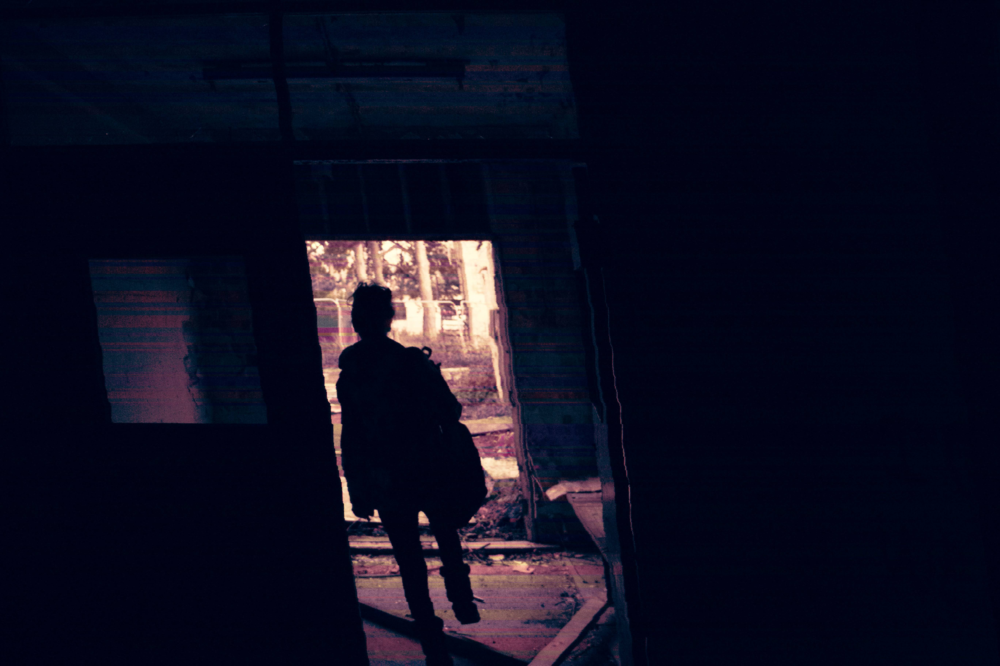
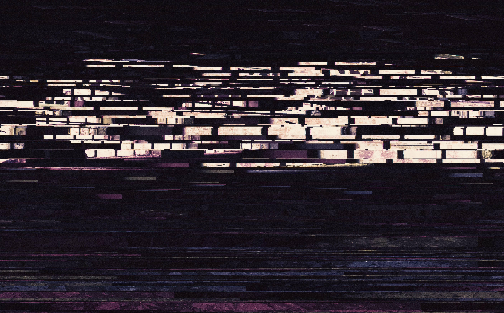
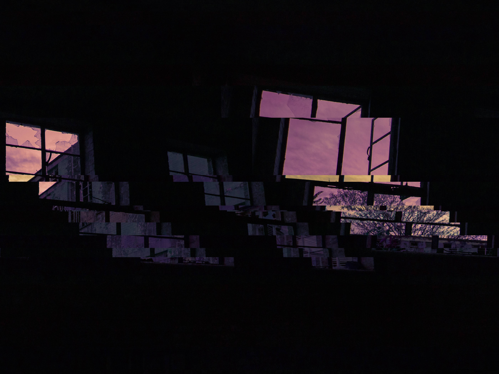

# bmp-corruptor

## [Back to archive readme](../README.md)

The following images were created using this tool, then graded and manipulated in photo-editing software.

Requires some understanding and manual tinkering to alter the style of skipping, however this is an okay-ish implementation which shouldn't be too hard to manipulate into something more advanced like an image processor or something. Worth replacing the file handling code with that in my other project, midi-to-virtualpiano.
