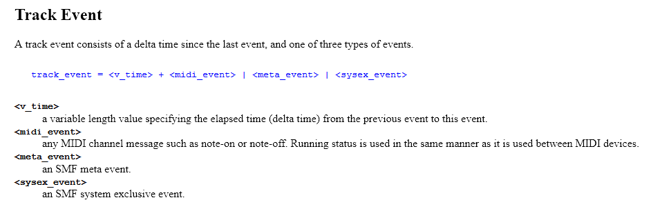

# Midi Notes

ARCHIVING ADDENDUM: This note page was originally hosted on Evernote, and has been rewritten into Markdown to be more easily archived on GitHub. I do not expect this link to work forever.

<https://www.evernote.com/shard/s746/client/snv?noteGuid=39fa506d-b5c5-480d-ab90-7c52439cdf44&noteKey=40850e7ce567bf69&sn=https%3A%2F%2Fwww.evernote.com%2Fshard%2Fs746%2Fsh%2F39fa506d-b5c5-480d-ab90-7c52439cdf44%2F40850e7ce567bf69&title=Midi%2BNotes>

Sources

- <http://www.ccarh.org/courses/253/handout/smf/>
- <https://www.csie.ntu.edu.tw/~r92092/ref/midi/>
- <https://www.csie.ntu.edu.tw/~r92092/ref/midi/midi_channel_voice.html>
- <https://www.csie.ntu.edu.tw/~r92092/ref/midi/midi_channel_mode.html>
- <https://virtualpiano.net/>
- example sheet: <https://virtualpiano.net/beethoven-moonlight-sonata/?highlight=moonlight%20sonata>
- file: <https://www.8notes.com/scores/1754.asp?ftype=midi>

## Introduction

The example sheet shown in the sources is as follows

This indicates direct key presses for the virtual piano, as the GUI on the website additionally has keyboard input. The square brackets indicate keys to be pressed at the same time, whereas keys on their own show keys to be played in sequence. The gaps show extra wait.

I'm looking to create a python script that converts midi files into sheet music like above, looking at key presses, with simultaneous key-down markers being grouped together into square bracket groups (possibly even sorted by keyboard layout), and key presses with delays resulting in sequence indicators.

## Header Chunk

header, variable length, start indicated by MThd ascii (address 00 to 03,  0x4d546864 on file). Following MThd is 4 bytes indicating header chunk length (always 00000006, or 6 bytes in length)

After that is 2 bytes that indicate format:

- 0 = single track file format
- 1 = multiple track file format
- 2 = multiple song file format (either multiple type 0 or multiple type 1 or a mix)

Next two bytes is the number of track chunks that follow the header

example: shows 2 tracks following header

Final two bytes of header information is the unit for timing, for this project it can be ignored as timing is handled by the user.

The useful information contained in the header is specifically just the quantity of tracks involved, as this allows the script to get a number for the amount of iterations it completes.

## Track Chunk

First track in example file

Metadata track comprised entirely of meta events; not standard form, however good for note. The events and data in said track are as follows:

- Length bytes (00 00 00 53, therefore 83 bytes long, however searching for the track end event is also useful)
- Time signature event (FF 58 04 xx xx xx xx 00) - not important
- Key signature event (FF 59 02 xx xx 00) - possibly important
- Set tempo event (FF 51 03 xx xx xx 00) - not important
- Track name event (FF 03 \<len byte\> \<text\>) - possibly important
- Text event (FF 01 \<len byte\> \<text\>) - artist name in this file, not important and not standard form
- Time signature event (FF 58 04 xx xx xx xx 00) - not important, not sure why it's repeated, different data however
- Track end event (FF 2f 00) - important

This information is significant as it gives insight into what kind of data shows up in tracks, and demonstrates edge cases and how I could handle them. For the example file, there's a track with no key press information, therefore the output file will be empty. As well as that, there's unimportant information that would be worth skipping over entirely by reading the byes (following MTrk look for FF 2F 00 only, otherwise look for midi events later on)

The midi events I'm interested in are key press indicators

The note-off message can be ignored as the target format doesn't specify key press length, technically an inaccuracy but accurate enough for this scenario. What this means is that the script needs to search for 9n xx xx chunks for key press indicators.

What this means is that, while I thought events were spaced by 00 chunks, the byte instead indicates the time length between the events. For the output I require, the script can utilise 00 length indicators to combine strings into a [group], however I'll likely need a counter variable instead of reading it directly, as a meta event could have the timing specified with a midi event 00 after it. Possibly a bool as I'm not currently interested in the amount of time, just if it's zero or non-zero.

## Pseudocode mockup

- Main portion of file handling, convert file to byte array following file identification.
- Read byte array at specific position to identify track amount.
- For loop starting at first MTrk, after MThd.
- In the MTrk, use the first 4 bytes to find the MTrk length.
- Scan forward through events to check for 9n half-byte. Incorporate algorithm that determines amount of time between events, possibly looking for event half-bytes that aren't key down indicators (Bn, 8n, An, Bn, Cn, Dn, En, Fn) and checking back one byte for the timing indicator.
- Once 9n half-byte has been found, currently ignore channel half-byte as the channel should be the same due to MTrk portions. Following that find 2 bytes (9n XX) that indicate which key is pressed, then use lookup to convert that from hex to virtualpianonote. Ignore following two bytes as weight information is not used.
- Using key found before, along with timing indicator bool, add to temp string.
- On finding the next non-zero time indicator, add square brackets to string if needed, then add to an output string with a space.
- Repeat loop until FF 2f 00 event is found, then output the output string to a file in the directory the midi file is found.

## Conversion Table

Middle-c is lowercase T, with hex value of 3C

According to the channel voice source listed at the top of this documentation:

That means that 3B will never be able to be represented using a traditional or virtual piano. This being said, 3A is perfectly acceptable, and relates to key `r`.

ARCHIVING ADDENDUM: this table could be completely wrong. Use at your own risk.

Here's a matrix I worked out, produced in photoshop. It shows the bytes from 00 to 7F, which are the limits of the key value in the midi event. This shows that the 00 to 7F range actually surpasses that of a standard piano, and includes extra sharp notes. Important to note is that the x at 5C shouldn't be confused with a null tag, which I've put as a grayed out x.

Event types and responses:

FF table below

